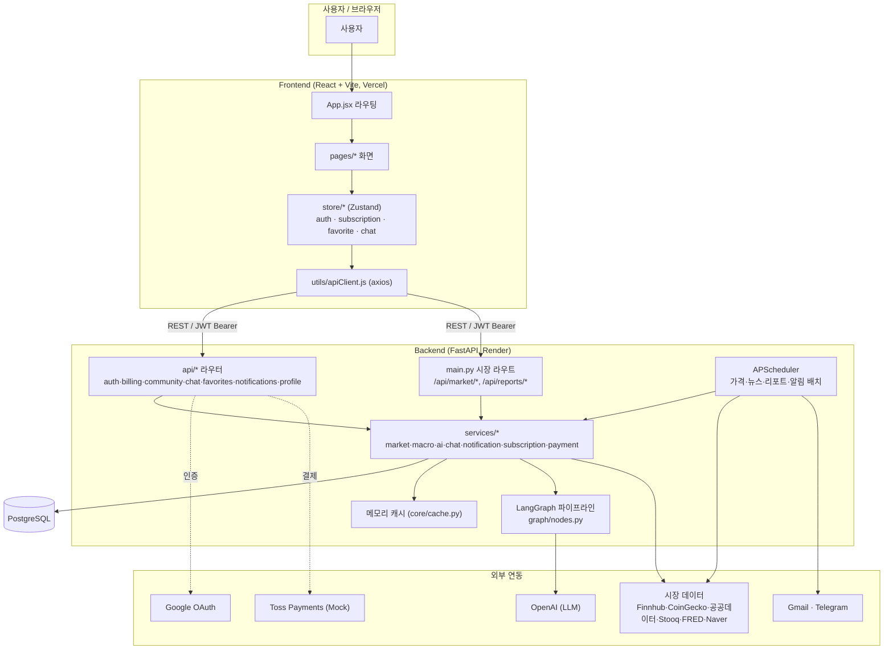
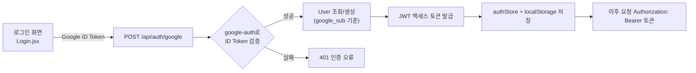
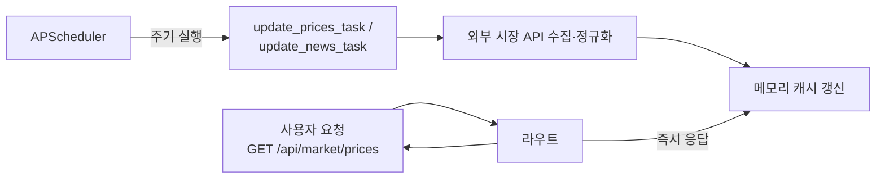
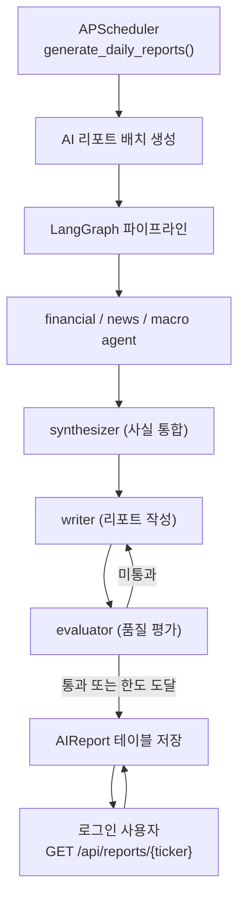
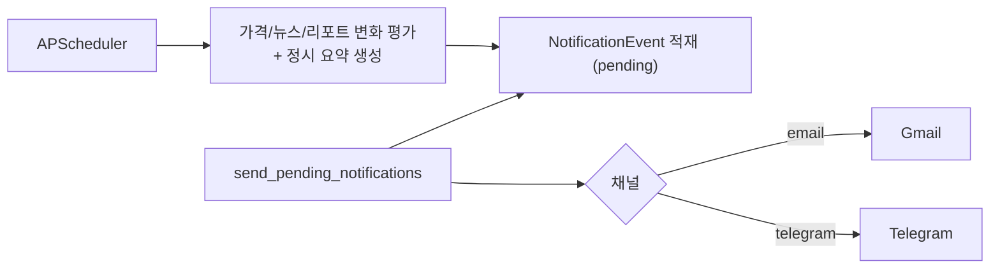

# 1. 시스템 흐름도 (Flow Chart)

서비스명: **AI Invest** / 기준: 현재 구현 코드(`backend/`, `frontend/`)

## 1.1 전체 시스템 구성도

## 1.2 인증 흐름 (Google 로그인 단일 흐름)

## 1.3 시장 데이터 조회 흐름 (캐시 우선)

> 핵심 원칙: 사용자 요청은 외부 API를 직접 호출하지 않고 **스케줄러가 갱신한 캐시**를 읽는다(`DEVELOPMENT_DIRECTION.md`).

## 1.4 AI 리포트 흐름 (스케줄 생성 → 저장 → 조회)

> AGENTS.md 섹션 14 원칙: **사용자/챗봇 요청은 실시간 리포트 생성을 트리거하지 않는다.** 기본 동작은 DB에 저장된 스케줄 리포트 조회이다. (`POST /api/ai/generate/{ticker}` 엔드포인트는 존재하나 운영 정책상 일반 사용자 흐름의 기본 경로가 아니다.)

## 1.5 알림 흐름 (즐겨찾기 기반)

