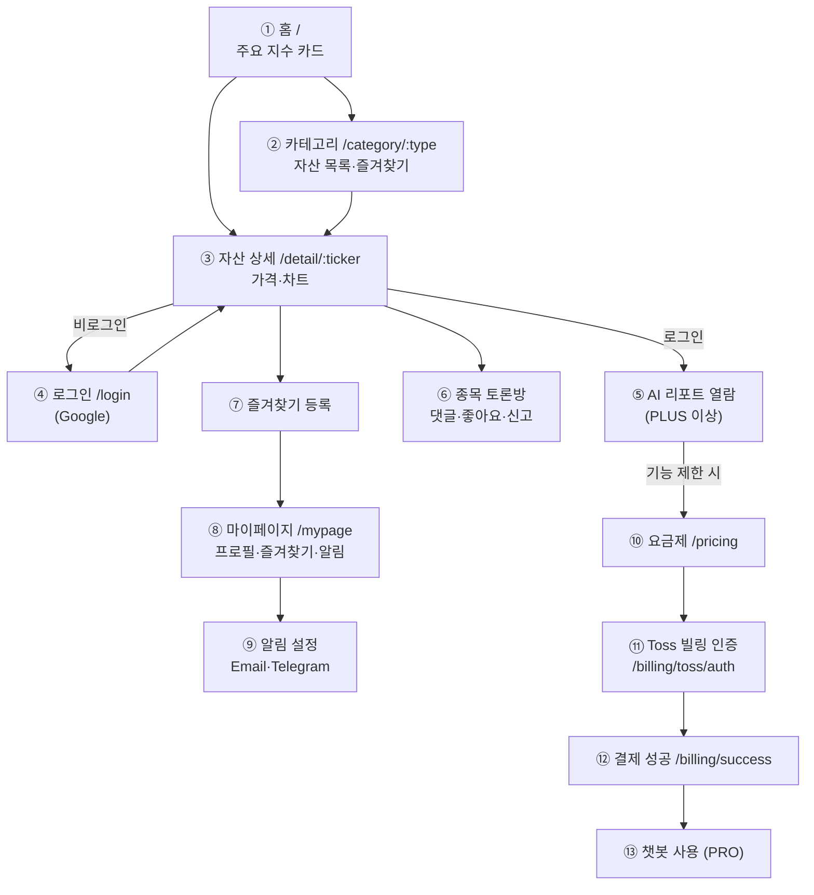

# 2. 스토리보드 (Storyboard)

기준 화면 라우트: `frontend/src/App.jsx` / 페이지: `frontend/src/pages/*.jsx`

## 2.1 라우트 ↔ 화면 매핑

| 경로 | 화면 컴포넌트 | 설명 |
| --- | --- | --- |
| `/` | `Home.jsx` | 메인 대시보드. 주요 지수 카드 |
| `/category/:type` | `CategoryView.jsx` | 카테고리별 자산 목록 (us_top10, kr_top10, macro, bonds, commodities, cryptos) |
| `/market/:ticker` | `MarketSnapshot.jsx` | 시장 스냅샷 |
| `/detail/:ticker` | `AssetDetail.jsx` | 자산 상세 (가격·AI 리포트·커뮤니티) |
| `/login` | `Login.jsx` | Google 로그인 |
| `/pricing` | `Pricing.jsx` | 구독 요금제 |
| `/mypage` | `MyPage.jsx` | 마이페이지 (프로필·즐겨찾기·알림 설정) |
| `/settings/notifications` | `MyPage.jsx` | 알림 설정 (마이페이지 진입점) |
| `/billing/success` | `BillingSuccess.jsx` | 결제 성공 |
| `/billing/cancel` | `BillingCancel.jsx` | 결제 취소 |
| `/billing/toss/auth` | `TossBillingAuth.jsx` | Toss 빌링 인증 |
| (전역) | `ChatbotLauncher.jsx` | PRO 등급일 때만 노출되는 챗봇 |

## 2.2 핵심 사용자 여정 (화면 전환)



## 2.3 화면별 스토리보드 (텍스트 와이어프레임)

### ① 홈 (`/`)
```
+--------------------------------------------------+
| [AI Invest]  홈 미국 한국 채권 원자재 코인  [로그인]|
+--------------------------------------------------+
|  주요 지수                                        |
|  [S&P500]  [Nasdaq]  [KOSPI]  [KOSDAQ]           |
|   현재가      현재가     현재가     현재가          |
|   ▲등락률     ▲등락률    ▲등락률    ▲등락률         |
+--------------------------------------------------+
```
- 동작: `GET /api/market/prices` 호출 → 지수 카드 렌더 → 카드 클릭 시 `/detail/{ticker}` 이동.

### ③ 자산 상세 (`/detail/:ticker`)
```
+--------------------------------------------------+
| 자산명 (티커)      현재가  ▲등락률   [★ 즐겨찾기]   |
+--------------------------------------------------+
| [1일][1개월][1년][5년]   가격 차트                 |
+--------------------------------------------------+
| AI 분석 리포트                                    |
|  - 비로그인/FREE: 흐림 처리 + 안내                 |
|  - PLUS/PRO: final_content(Markdown) 표시         |
+--------------------------------------------------+
| 종목 토론방                                       |
|  [댓글 입력 ____________] [전송]                  |
|  · 닉네임 · 내용 · ♥좋아요 · 신고 · (본인)수정/삭제|
+--------------------------------------------------+
```
- 동작: 시장가 매칭 → 히스토리 `GET /api/market/history/{ticker}` → 리포트 `GET /api/reports/{ticker}`(권한) → 댓글 `GET /api/community/{ticker}/comments`.

### ⑧ 마이페이지 (`/mypage`)
```
+--------------------------------------------------+
| 프로필   닉네임 [____] (변경)                      |
| 구독      현재 등급: FREE / PLUS / PRO            |
| 즐겨찾기  · 자산1  · 자산2 ...                     |
| 알림 설정 [ ]이메일 [ ]Telegram  임계값 [3%]       |
|           수신 이메일/chat_id 인라인 입력           |
+--------------------------------------------------+
```

### ⑩~⑬ 구독·결제·챗봇
```
요금제(/pricing) → Toss 빌링 인증(/billing/toss/auth)
   → 성공(/billing/success) → 등급 상향(PLUS/PRO)
   → PRO면 우하단 챗봇 런처 노출
```

## 2.4 권한별 노출 차이 (구독 등급)

| 기능 | 비로그인 | FREE | PLUS | PRO |
| --- | --- | --- | --- | --- |
| 시세·차트·뉴스 조회 | ○ | ○ | ○ | ○ |
| 댓글 조회 | ○ | ○ | ○ | ○ |
| 댓글 작성/좋아요/신고 | ✕ | ○ | ○ | ○ |
| AI 리포트 열람 | ✕ | ✕ | ○ | ○ |
| 즐겨찾기 알림(Email/Telegram) | ✕ | ✕ | ○ | ○ |
| 챗봇 | ✕ | ✕ | ✕ | ○ |

> 출처: `backend/app/services/subscription_service.py`의 등급별 entitlement.
