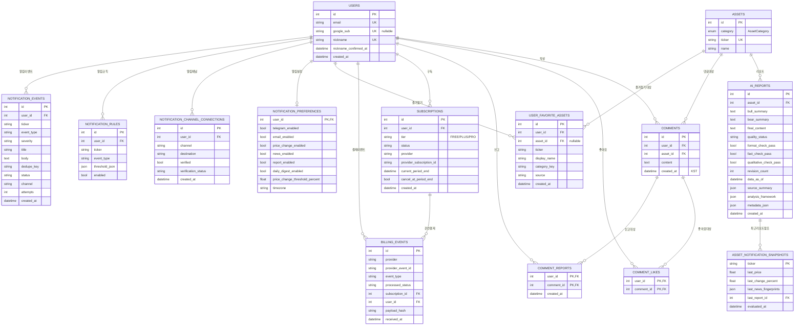

# 4. ERD (Entity Relationship Diagram)

기준: `backend/app/models.py` (SQLAlchemy ORM). 데이터베이스: PostgreSQL.

## 4.1 ERD 다이어그램

## 4.2 엔티티 요약

| 테이블 | 역할 | 주요 키/제약 |
| --- | --- | --- |
| `users` | 사용자 계정 | `email`, `google_sub`, `nickname` 각 UNIQUE |
| `assets` | 금융 자산 메타 | `ticker` UNIQUE, `category` Enum |
| `ai_reports` | AI 투자 리포트 | `asset_id` FK, 품질 메타데이터 다수 |
| `comments` | 종목 토론 댓글 | `user_id`/`asset_id` FK, `created_at` KST |
| `comment_likes` | 댓글 좋아요 | 복합 PK (user_id, comment_id) |
| `comment_reports` | 댓글 신고 | 복합 PK (user_id, comment_id) |
| `subscriptions` | 구독 | (provider, provider_subscription_id) UNIQUE |
| `billing_events` | 결제 이벤트(멱등) | (provider, provider_event_id) UNIQUE |
| `user_favorite_assets` | 즐겨찾기 | (user_id, ticker) UNIQUE |
| `notification_preferences` | 알림 설정 | PK = user_id (1:1) |
| `notification_channel_connections` | 알림 채널 | (user_id, channel) UNIQUE |
| `notification_rules` | 알림 규칙 | user_id/ticker 인덱스 |
| `asset_notification_snapshots` | 알림 평가 스냅샷 | PK = ticker |
| `notification_events` | 알림 이벤트/발송 | (user_id, dedupe_key, channel) UNIQUE |

## 4.3 AssetCategory Enum

`INDEX`, `BOND_US`, `BOND_KR`, `STOCK_US`, `STOCK_KR`, `COMMODITY`, `CRYPTO`

> 모든 FK에는 사용자/자산 삭제 시 종속 데이터 정리를 위한 cascade(`all, delete-orphan`)가 다수 적용되어 있다(`models.py` relationship 정의 참조).
